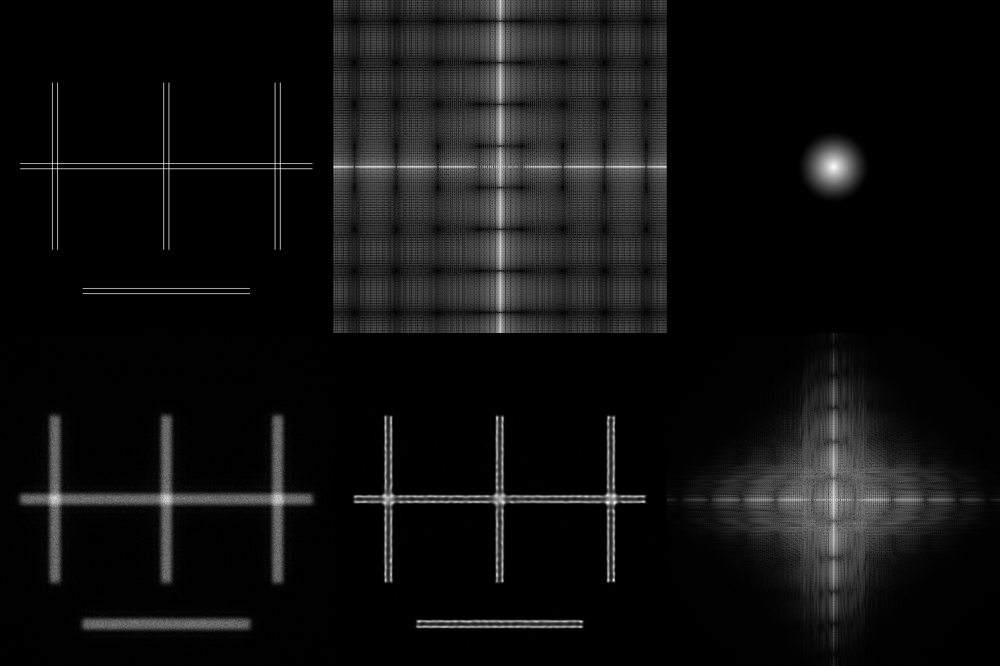
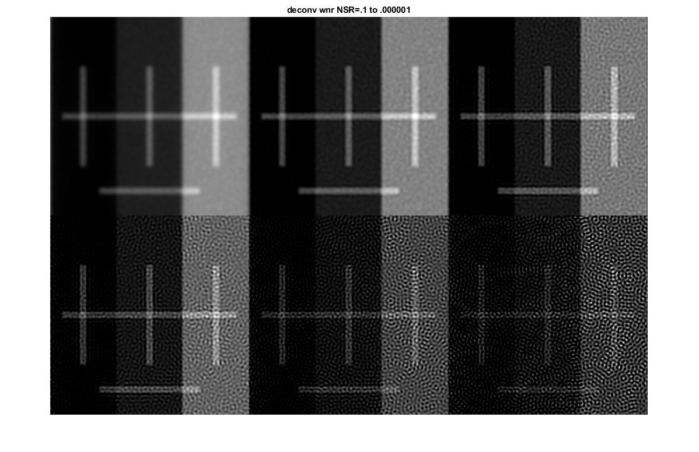

# James Manton's RL positivity demonstration with additional Wiener Filter comparison and SSIM measurement. 

[see here](https://github.com/bnorthan/rl_positivity_sim/blob/master/docs/getstarted.md) for info about new options I have added.

A simple simulation to show the effect of the positivity constraint in Richardson-Lucy deconvolution.
Originally written in MATLAB, this code can be successfully run in [Octave](https://www.gnu.org/software/octave/) after installing and loading the [statistics package](https://octave.sourceforge.io/statistics/index.html) from [Octave Forge](https://octave.sourceforge.io/).
Support for GPU acceleration is provided through the `USE_GPU` flag, but is overkill for the example ground truth provided by default.

## Example results



The image above shows results of the simulation when run using the following parameters:
```
max_photons = 100;
num_iter = 100;
pixel_size = 20;
spacing_px = 4;
n = 512;
lambda = 510;
numerical_aperture = 1.4;
background_level = 0;
left_bg = 0;
mid_bg = 0.05;
right_bg = 0.25;
```
As the RNG seed is not set before each run, the results will vary slightly in noise profile every time the simulation is repeated.
Here, the line-pair spacing is 80 nm, while the resolution limit of the imaging system is ~180 nm.
Despite this, RL produces an output with a distinctly resolved line pair in the region with zero background.
The line pair remains an unresolved 'block' in regions with a higher background level.

## Wiener Filter



The image above shows results of applying the matlab Wiener implementation ([deconvwnr](https://www.mathworks.com/help/images/ref/deconvwnr.html)) passing NSR parameter with value 1 through 0.00001.

## Structural Simularity Index

Below is value of the structural similarity index ([matlab ssim function](https://www.mathworks.com/help/images/ref/ssim.html)) between the deconvolved and original image for several methods.  This was measured with and without background (by setting left_bg,mid_bg, and right_bg to 0).  With background a Wiener Filter with NSR = 0.1 had the highest SSIM.  Without background 100 iterations of Richardson Lucy had the highest SSIM.  

| Method | SSIM (image has background) | SSIM (without background) |
|--------|--------------------|---------------- |
|Richardson Lucy 100 iterations | 0.6265 | 0.9083 |
|Wiener NSR=1|  0.5599 | 0.6835 |
|Wiener NSR=.1 | 0.6838 |0.7945 |
|Wiener NSR=.01 | 0.5597 |0.7017 |
|Wiener NSR=.001 |0.3654 |0.5917 |


