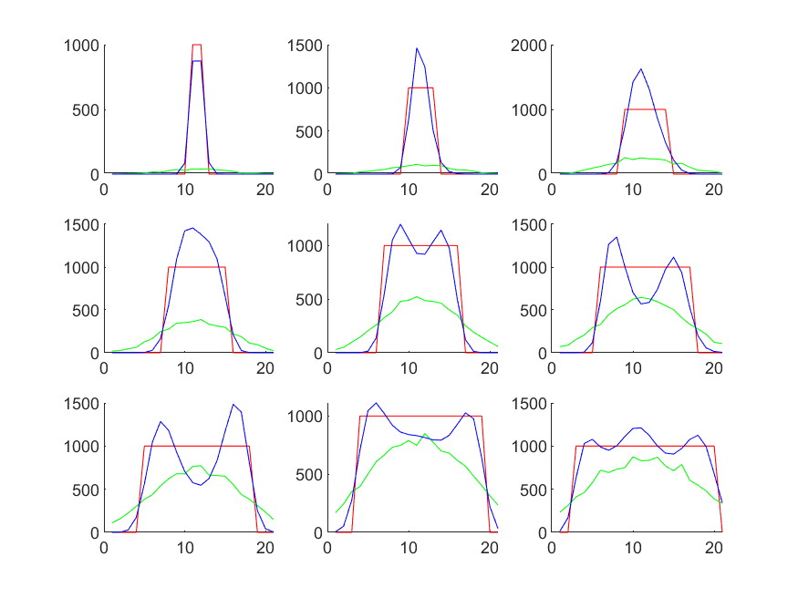
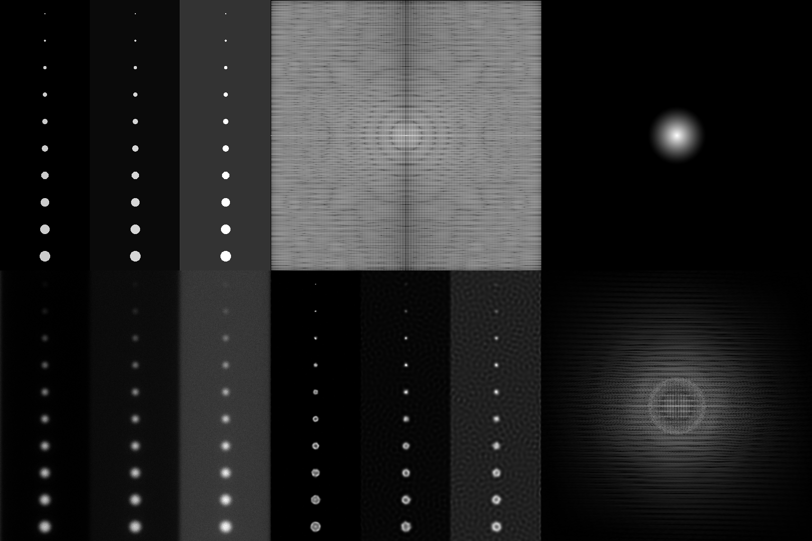

## Parameters  
description: Restore circles of varying size, 1000 iterations of RL  
max photons 1000  
num iter 1000  
  pixel size 20  
  spacing px 4  
  n 512  
lambda 510  
numerical aperture 1.400000  
background level 0  
left background 0.000000  
mid background 0.050000  
right background 0.250000  
## Line Plots (medium noise)  
red: ground truth  
green: imaged   
blue: restored   
  
## Images  
  
